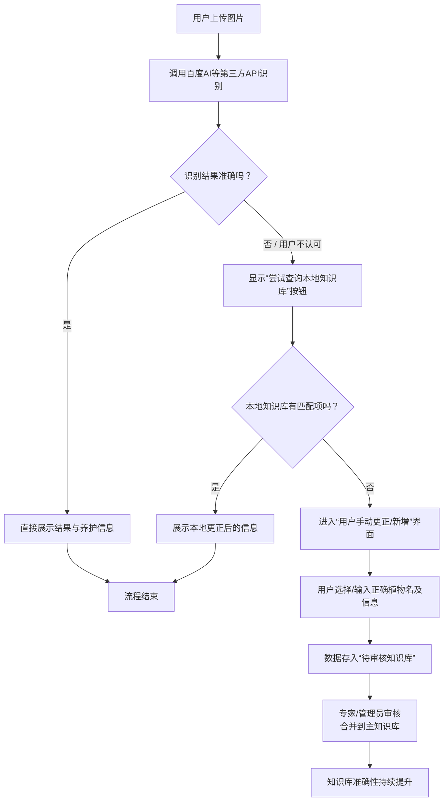

**“植遇”植物识别与智能养护助手 V2.0 需求文档**

- **版本**：V2.0  
- **日期**：2024 年 5 月 20 日（可后续更新为实际定稿日期）  
- **定位**：在 V1.0 纯前端 MVP 成功验证之后，引入后端服务与本地数据库，以“知识库 + 社区 + 交易”三位一体的形式，提升整体产品价值与商业化空间。


## 一、项目目标与价值升级

- **总体目标**：
  - 从“工具型识别 + 提醒”升级为“植物知识服务平台”；
  - 建立可持续迭代的 **本地植物知识库**，让准确性随时间不断提升；
  - 通过 **社区交流区** 与 **购买区**，打通“认得出 → 养得好 → 买得到”的完整链路。

- **核心价值补充（相对 V1.0）**：
  - **更可靠的数据来源**：从前端静态数据升级为后端主知识库 + 待审核知识库，支持专家审核与持续更新。
  - **更丰富的使用场景**：不仅仅是“拍照识别”，还包括按名称/别名检索的植物百科、社区讨论、购买推荐等。
  - **更强的商业闭环能力**：通过购买区与电商对接，为后续商业化探索预留空间。


## 二、数据与容错：本地知识库与自建后端

- **技术演进**：
  - 引入后端服务与数据库（如 Node.js + NestJS / Spring Boot + MySQL / PostgreSQL 等）。
  - 采用分层结构：**主知识库（线上数据库） + 本地缓存（端上存储）**。

- **目标能力**：
  - **容错与高可用**：
    - 第三方 API 调用失败时，能够直接回退到本地知识库（名称查询与关键字模糊匹配）。
    - 针对网络不稳定场景，前端可在本地缓存最近查询过的植物信息。
  - **统一数据源**：
    - 所有植物条目（名称、别名、图片、养护知识、标签）统一由后端知识库提供。
    - 前端仅做缓存与展示，降低数据不一致风险。

- **本地数据库 / 缓存策略**：
  - 热点植物数据（高频查询）下发并缓存至本地（例如最近 50–200 条）。
  - 通过版本号或时间戳定期增量更新。


## 三、植物百科模块：按名称 / 别名检索

- **功能描述**：
  用户可不依赖拍照，直接通过 **名称 / 别名 / 拼音 / 模糊关键字** 搜索植物百科信息。

- **核心需求**：
  - **搜索入口**：
    - 首页或“百科”页顶部提供搜索框；支持历史搜索记录。
  - **检索能力**：
    - 支持通过 **标准名、常见别名** 检索；
    - 支持简易模糊匹配（如“绿萝”“lvluo”）。
  - **展示内容**：
    - 植物图片（主图 + 可选多图）；
    - 基本信息（中文名、学名、别名、科属）；
    - 养护要点（光照、浇水、施肥、温度、湿度、难度等级）；
    - 推荐场景标签（如“新手友好”“耐阴”“阳台党推荐”等）。

- **数据库设计要点（示意）**：

```json
{
  "id": 1001,
  "name": "绿萝",
  "aliases": ["黄金葛", "黄金藤"],
  "pinyin": "lüluo,lulou",
  "category": "天南星科",
  "tags": ["新手友好", "耐阴", "净化空气"],
  "maintenance": {
    "light": "明亮散射光为宜，可耐弱光",
    "watering": "见干见湿，避免长期积水",
    "wateringInterval": 7,
    "fertilizing": "生长季 30 天一次稀薄液肥"
  }
}
```


## 四、知识库纠错与用户录入（待审核机制）

- **场景 1：本地未查到时的录入**：
  - 当用户通过名称 / 别名搜索无结果时，展示“未找到，去录入”按钮。
  - 进入“手动录入植物信息”页面，允许用户填写：名称、别名、图片、基础养护信息等。
  - 提交后进入 **“待审核知识库”**，标记为 `pending` 状态，由管理员 / 专家审核后再合入主库。

- **场景 2：识别结果错误时的更正**：
  - 用户在识别结果页选择“结果不准 / 我要纠正”。
  - 若本地知识库中已有匹配植物，则：
    - 用户直接从建议列表中选择正确植物；
    - 系统记录 **“原识别结果 → 正确植物 ID”** 的映射，写入纠错表。
  - 若本地无匹配项，则：
    - 引导用户进入“手动更正 / 新增条目”页；
    - 新条目同样进入“待审核知识库”。

- **审核流程（简化版）**：
  - 后台管理端展示 `pending` 条目列表（包括来源用户、时间、原始识别结果等）。
  - 管理员 / 专家可：
    - 通过（合并到主知识库）；
    - 拒绝（退回并可给出理由）；
    - 修改后通过（校正信息再合入）。


## 五、社区交流区：按植物聚合话题

- **功能定位**：围绕“具体植物”聚合用户经验与案例，解决“同一植物，不同环境怎么养”的问题。

- **核心设计**：
  - **入口形式**：
    - 每个植物百科详情页增加“交流区 / 讨论”入口；
    - 独立“社区”Tab，支持按植物 / 标签筛选话题。
  - **内容形态**：
    - 简单帖子流：包含标题、内容、图片（如养护前后对比）、关联植物 ID；
    - 支持评论与点赞；
    - 后期可扩展话题类型，如“求助贴”“经验贴”等。
  - **运营与治理**：
    - 基础的内容审核（敏感词、图片审核依赖第三方内容安全 API）；
    - 简单等级或勋章体系（例如“绿萝达人”“多肉大师”），增强社区参与感。


## 六、购买区：从内容到交易的闭环

- **功能定位**：在不打扰用户体验的前提下，提供 **“适度推荐 + 精选购买入口”**，串联平台内容与电商供应链。

- **设计要点**：
  - **入口方式**：
    - 植物详情页下方增加“购买同款 / 推荐周边”区块；
    - 独立“商城”Tab，按照植物类型、场景、难度等进行筛选。
  - **商品类型**：
    - 植物（盆栽、多肉、种子）；
    - 周边（花盆、营养土、肥料、工具套装等）。
  - **电商模式选择**：
    - 初期建议对接第三方小程序 / H5 商城（如淘宝联盟、京东联盟、小红书好物等），降低自建成本；
    - 后期视业务发展考虑自建订单、库存、售后体系。


## 七、V2.0 关键流程：识别 + 本地知识库 + 用户纠错闭环

以下为“用户上传图片 → 调用第三方 API → 本地知识库兜底 → 用户纠错 → 待审核知识库 → 主知识库进化”的核心流程抽象：



- **流程说明要点**：
  - 第三方 API 负责**初始识别**，本地 / 远端知识库负责**纠错与兜底**；
  - 用户纠错行为被结构化沉淀为数据，经审核后合入主知识库，使识别准确率 **越用越高**；
  - V1.0 中的本地 `correctionMap` 思路，在 V2.0 中升级为 **后端纠错表 + 待审核机制**。


## 八、V2.0 阶段性目标与里程碑

- **阶段一：基础数据与后台能力搭建**
  - 完成后端服务与数据库搭建；
  - 完成主知识库表、纠错表、待审核表等核心数据结构设计；
  - 搭建简单后台管理端，支持基本的审核与数据维护。

- **阶段二：面向用户的百科 + 纠错功能上线**
  - 上线“植物百科”搜索与详情；
  - 打通识别结果与百科详情的跳转；
  - 上线“查不到 → 录入”“识别错误 → 更正并提交审核”完整流程。

- **阶段三：社区与购买区试运行**
  - 上线按植物聚合的讨论区；
  - 对接至少 1–2 家第三方电商渠道，完成购买区 MVP；
  - 开始监控用户留存、UGC 量、转化率等核心指标，为后续 3.0 版本做准备。


